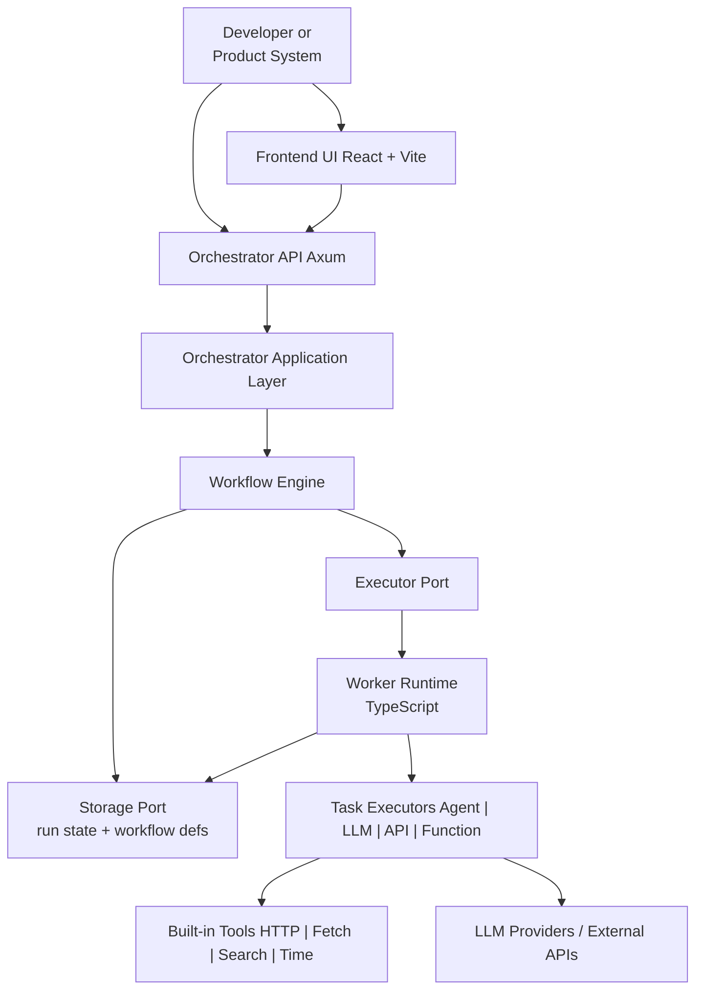

# RunHelm

RunHelm is an agentic workflow orchestrator for teams that want to compose AI agents, API calls, and code execution into reliable multi-step runs.

The project separates control-plane concerns from execution concerns:

- The `orchestrator` owns workflow definitions, run state, scheduling, and status APIs.
- The `worker` executes individual tasks in an isolated runtime with typed inputs and outputs.
- The `frontend` is the start of an operator UI for workflows, runs, and system visibility.

## Why RunHelm

Most agent demos stop at "the model produced an answer." Real systems need more:

- structured workflows instead of one-off prompts
- explicit task dependencies and data flow
- resumable execution and observable run state
- typed contracts between steps
- pluggable execution backends and credentials

RunHelm is being built to provide that execution model. It treats an agent the same way it treats a function or API task: as a node in a workflow with declared inputs, outputs, side effects, and credentials.

## What A Workflow Looks Like

A workflow is defined as JSON and contains:

- tasks
- data bindings between task outputs and downstream task inputs
- per-task input schemas and optional output schemas
- task kinds such as `Agent`, `LLM`, `ApiCall`, and `Function`

That definition becomes a workflow instance at runtime. The orchestrator tracks task state (`Pending`, `Running`, `Completed`, `Failed`) and promotes the overall run state as work progresses.

## Architecture



## Component Roles

### `orchestrator/`

Rust control plane built around ports and adapters:

- `src/core/engine.rs` runs workflow instances by finding runnable tasks, executing them, validating outputs, and propagating data bindings.
- `src/core/models.rs` defines workflow, task, run, and status models.
- `src/ports/` abstracts persistence and execution so storage backends and worker backends stay replaceable.
- `src/api/` exposes HTTP endpoints such as `/health`, `POST /workflows`, and `GET /workflows/:id`.

Current default wiring uses in-memory storage and a fake executor, which keeps the control-plane behavior easy to develop and test before infrastructure choices are finalized.

### `worker/`

TypeScript execution runtime for task payloads:

- receives task payloads over stdin in the current skeleton
- selects the correct executor through `ExecutorFactory`
- supports agent, LLM, API-call, and function-style task execution
- validates task output against JSON Schema using `ajv`

The agent executor already shows the intended shape of the system: provider-agnostic model selection, credential lookup behind a port, and built-in tools for retrieval and external calls.

### `frontend/`

React operator console prototype for:

- workflow visibility
- run monitoring
- operational status views

It is currently a UI shell rather than a fully integrated console, but it establishes the product direction for observing orchestrated runs.

## Execution Model

At a high level, RunHelm executes a workflow like this:

1. A workflow definition is registered with tasks and data bindings.
2. A workflow instance is created for a specific run.
3. The orchestrator identifies tasks whose dependencies are satisfied.
4. Runnable tasks are dispatched through an executor backend.
5. Task outputs are schema-validated and propagated to downstream tasks.
6. State is persisted after progress so runs can be inspected and resumed.

This design keeps orchestration logic deterministic while allowing execution environments to evolve independently.

## Design Principles

The repository is already aligned around a few architectural constraints:

- side effects live behind ports and adapters
- pure coordination logic stays in cohesive modules
- schemas define contracts between tasks
- execution backends remain pluggable
- TypeScript is preferred for dynamic task execution, while Rust provides a strong orchestration core

## Current Status

RunHelm is in an early implementation stage. The important pieces already visible in the codebase are:

- workflow engine and run-state model
- API skeleton for orchestration
- in-memory storage adapter
- fake and Docker-oriented executor adapter groundwork
- worker runtime with multiple task executor types
- frontend dashboard prototype

Not everything is wired end-to-end yet, but the repository already reflects the intended architecture rather than a throwaway prototype.

## Local Development

### Orchestrator

```bash
cd orchestrator
cargo run
```

The orchestrator starts an Axum server on `0.0.0.0:3456`.

### Worker

```bash
cd worker
npm install
npm run build
npm start
```

The current worker reads task payloads from stdin and logs execution results.

### Frontend

```bash
cd frontend
npm install
npm run dev
```

## Direction

RunHelm is aimed at teams building long-running, inspectable AI systems where workflows matter more than single prompts. The goal is a platform where agents are first-class workflow nodes, execution is isolated, contracts are typed, and operators can understand exactly what happened in every run.
