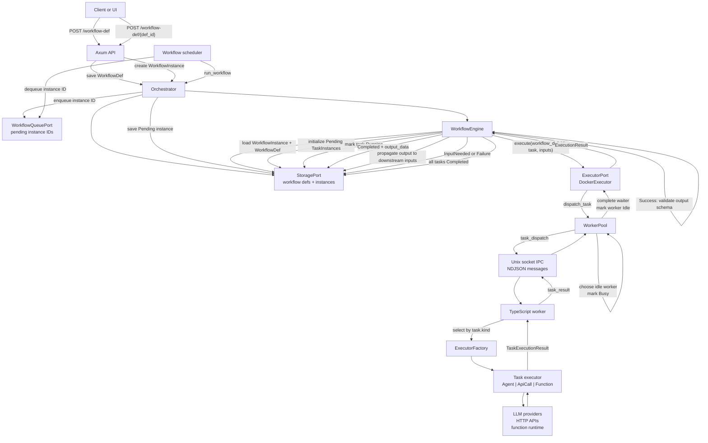
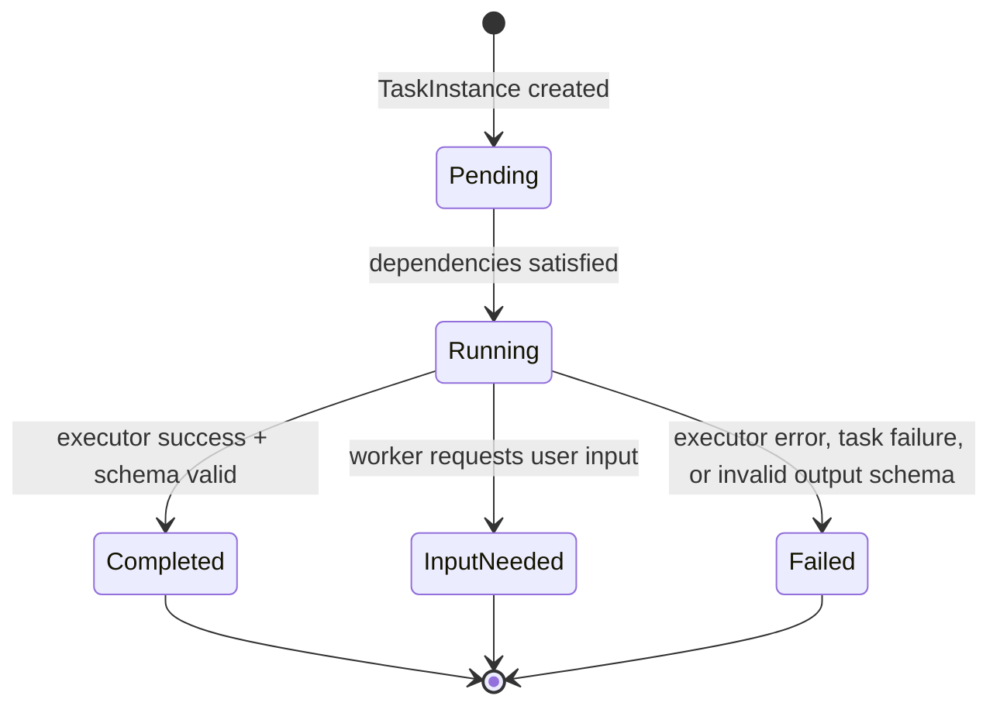
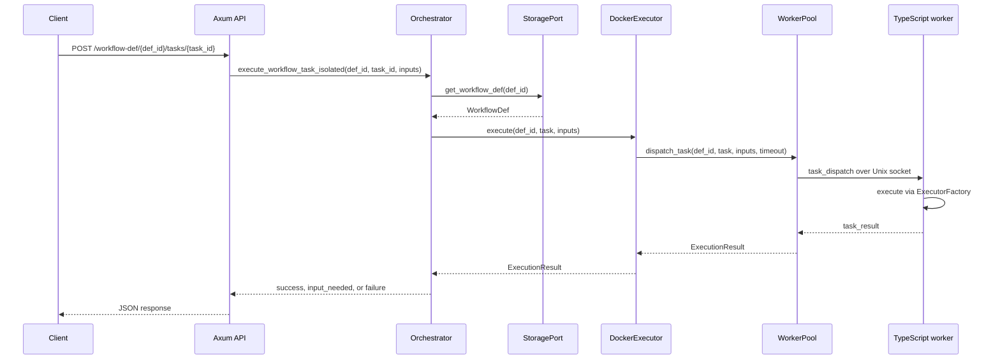

# RunHelm Task Submission and Execution Flow

This diagram shows the current task submission path through the Rust orchestrator, the in-memory workflow queue, the IPC-backed executor adapter, and the TypeScript worker runtime.

## Task State Loop

## Isolated Task Execution

`POST /workflow-def/{def_id}/tasks/{task_id}` bypasses the workflow queue and dataflow engine. It loads the registered workflow definition, finds one task, and sends that task directly to the configured executor with the request inputs.

